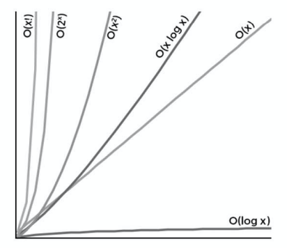

### BigOとは
- アルゴリズムがどれくらい高速かを表す表記法  
- 具体的にはO(演算の回数)で表す

例: Binary Seachの時間計算量
O(logN) => 最悪でも、logN回の演算を実行するアルゴリズム

### 時間計算量と空間計算量  
- 空間計算量(space complexity): アルゴリズがどれくらいのメモリ容量を必要とするか
- 時間計算量(time complexity): アルゴリズムがどれくらいの時間を要するか

### BigOは最悪の場合の時間計量を表す

### 一般的なBigOとその比較

1. O(1): データ量とは関係なく、処理時間が一定 

2. O(log n): データが大きくなっても、計算時間はあまり変わらない。処理するたびにターゲットが絞られて早くなる

3. O(n): データが大きくなればなるだけ、計算時間がかかる

4. 0(n log n): ちょっと重いO(n)程度。O(n)相当のループと O(log n)相当のループの2つが合わさっているアルゴリズム

5. O(n^2): 二重ループ。要素からすべての組み合わせのペアについて調べるようなアルゴリズム。O(n)よりかなり遅く、これ以上は処理が遅すぎて使いにくい。

6. O(2^n): 個の部分集合のパターンを素直に全部列挙するようなアルゴリズム

6. O(n!): Nの階乗に比例した時間のかかるアルゴリズム。セールスマン問題はこの計算量

 

 

| 早い | | | | これより遅いと使いにくい | | | 遅い  | 
| :--: | :------: | :--: | :--------: | :----------------------: | :----: | :----: | :---: | 
| O(1) | O(log n) | O(n) | O(n log n) | O(n^2) | O(2^n) | O(3^n) | O(n!) | 