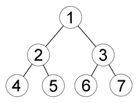

### 幅優先探索 (breadth first search)とは

- 探索開始地点に近い点からまんべんなく探索していく探索方法

- 探索を開始するノードの隣接ノードを全て走査し終わってから、開始ノードの隣接ノードの隣接ノードを調べる(それを繰り返す)

- 以下の図はノード(調べる順番)を表す

[幅優先探索 【BFS】 Breadth-First Search / 横型探索](https://e-words.jp/w/幅優先探索.html)

---

### 実装

(画像を参考に)

- 最初に全ての隣接ノード(2,3)を順々に調べていく

- 全ての隣接ノードを調べ終わったら、調べ終わった隣接ノードの隣接ノードを全て調べる(4,5,6,7)

- Queue を用いて実装する