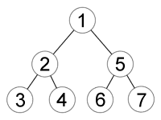
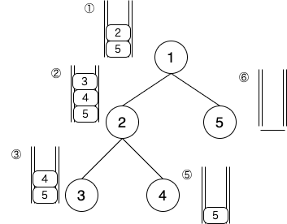

### 深さ優先探索 (depth first search)とは

- 探索を開始するノードの隣接ノードのうちの1つのノードからからその終端の隣接ノードまでを走査し、また、開始ノードの隣接ノードを1つ選び終端まで走査するを繰り返す方法

- わかりやすく言うと、行けるところまで行ったら、また戻ってそれを繰り返す

- 以下の図はノード(調べる順番)を表す

  

  [Souorce: 深さ優先探索 【DFS】 Depth-First Search / 縦型探索](https://e-words.jp/w/深さ優先探索.html)

---

### 実装

(画像を参考に)

- rootノードをスタックにプッシュする  
   visited: []  
   stack: [1]

- スタックをポップして1をvisitedに入れる。1の隣接ノードをスタックにプッシュする  
   visited: [1]  
   stack[5, 2]

- スタックからポップして2をvisitedに入れ、その隣接ノードをスタックにプッシュする  
   visited: [1, 2]  
   stack: [5, 4, 3]

- スタックからポップして3をvisitedに入れる。隣接ノードがないので、スタックにプッシュするものはない  
   visited: [1, 2, 3]
  stack: [5, 4]

を繰り返すイメージ

- Stack を用いて実装する

[Source: 【C#】深さ優先探索(DFS)を実装してみる](https://www.hanachiru-blog.com/entry/2020/05/21/120000)

---

### 深さ優先探索を使うケース 

- 全通りを列挙したい (一筆書きのようにデータを列挙したい) 場合

- 辞書順で最初の解を求める場合(グラフはsortされている必要がある)