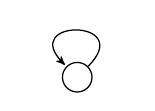
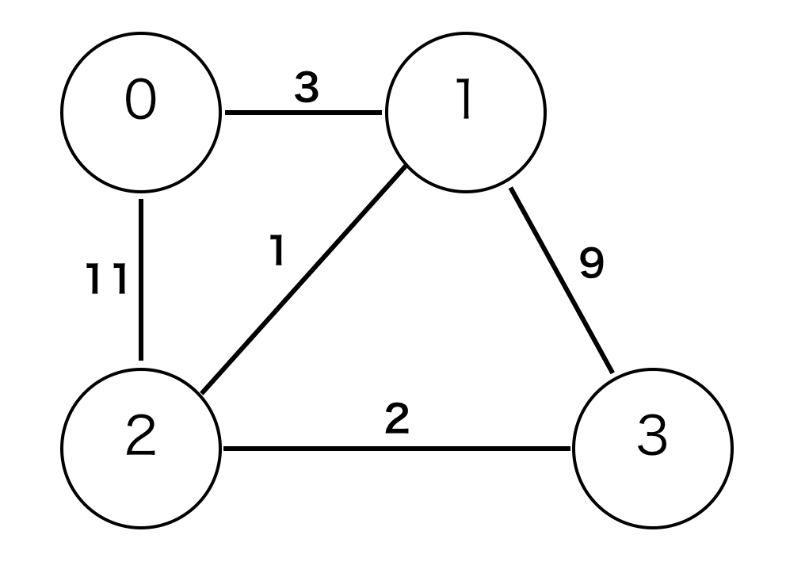
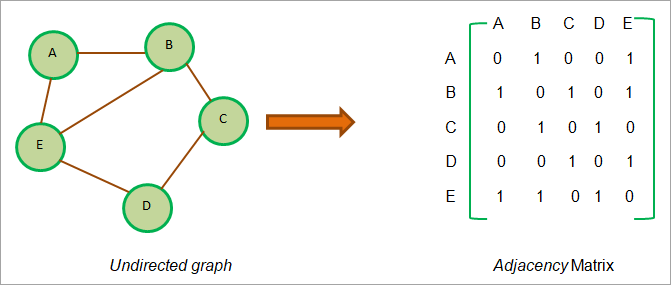
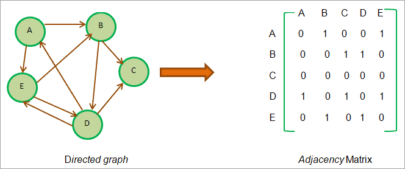
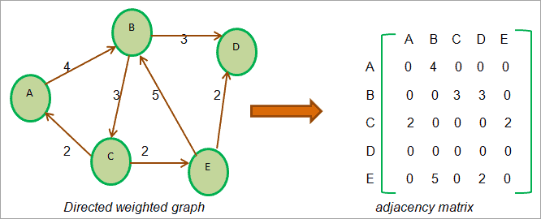
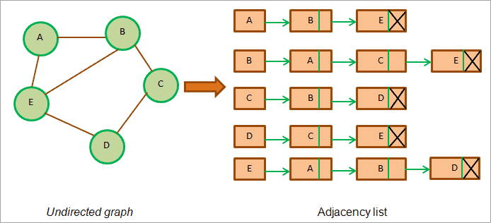
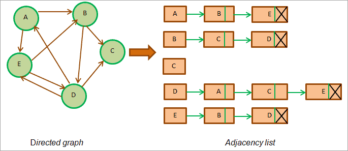
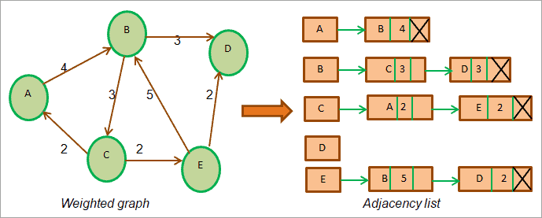

### グラフとは

- データ構造の一種

- ノードとエッジを持つ

Source: [Graphs in Data Structure and Algorithm](https://www.boardinfinity.com/blog/graphs-in-data-structure/)

- 一つのエッジの両側に必ずノードが存在しないといけない

- エッジの元と先は同一ノードでもいい、これをループと呼ぶ

Source: [グラフ理論入門](https://dev.classmethod.jp/articles/graph-theory/)

- 一つの単独のノードだけでもグラフと呼ぶ  
-> 非連結グラフ(disconnected graph)

---

### 有向グラフ (Directed graph)

- エッジは"一方向の向き"を持つ

---

### 無向グラフ (Undirected graph)

- エッジは向きを持たない

---

### 重み付きグラフィック (Weighted graph)

- エッジに重みがつく
- エッジの重みによって、ノード間の移動にかかる時間やコストなどを表現することができる

[Source: グラフ(Graph)のデータ構造と基本用語の定義](https://algo-logic.info/graph/#)

---

### 実装方法

- 隣接行列(adjacent matrix)を利用する方法

    - 無向(undirected graph)の場合  
    NodeAとNodeBは繋がっているので、[A][B],[B][A]は1(true)になる  
    一方NodeAとNodeCは繋がっていないので、[A][C],[C][A]は0(false)となる
    

    - 有向グラフ(directed graph)の場合  
    NodeA -> NodeBの方向で繋がっているので、[A][B]は1。  
    一方でNodeB -> NodeAの方向で繋がってはいないので、[B][A]は0
    

    - 重み付き有向グラフ(directed weighted graph)の場合  
    NodeA -> NodeBの方向で繋がっており、重さはなので、[A][B]は4
    

[Source: Java Graph Tutorial – How To Implement Graph Data Structure](https://www.softwaretestinghelp.com/java-graph-tutorial/)

- 隣接リスト(adjacent list)を利用する方法

    - 無向(undirected graph)の場合  
    NodeAはNodeBとNodeEにつながっているので、A -> B -> Eと表される
    

    - 有向グラフ(directed graph)の場合  
    NodeA -> NodeBの方向で繋がっているため、A -> Bはあるが、B -> Aはない
      

    - 重み付き有向グラフ(directed weighted graph)の場合  
    有向グラフに重みを加えたバージョン。重みを記録するメモリが必要になる
    
[Source: Java Graph Tutorial – How To Implement Graph Data Structure](https://www.softwaretestinghelp.com/java-graph-tutorial/)

---

### 実装方法による違い

- 隣接行列(adjacent matrix)の場合
接続されていないという情報まで、記録する必要があるため、メモリは多く消費する

