### 最短経路を調べる

- ダイクストラ法 (Dijkstra's algorithm)
    - 非負数の重みつきグラフにおいて2頂点間の最短距離を求めるための優良アルゴリズム

---

### イメージ

- 開始ノードからすべてのノードの最短距離を求める
    -> 終点ノードに辿り着く頃には、始点ノードから最短ノードへの最短距離がもとまっている

---

### 手順

用語  
```
- 未確定ノード:　開始ノードからそのノードまでの最小コストが決まっていないノードのこと
- 確定ノード: 開始ノードからそのノードまでに最小コストが確定したノード
```

<br>

手順
```
1. 開始ノードに0を入れる(開始ノードから開始ノードへのコストは0)

2. 未確定のノードの中から確定ノードから最もコストの小さいノードを選ぶ。選んだノードは確定ノードとする。

3. 手順2で確定したノードの隣接ノードで未確定ノードの最小コストを更新する。

4. 全ノードが確定ノードなら終了。そうでなけれ手順2に戻る
(*終了ノードが確定ノードなら終了でもいい気がする)
```

例:　以下のようなグラフがある

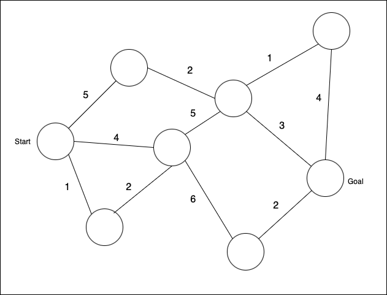

<br>

1.まずは開始ノードに0を設定する

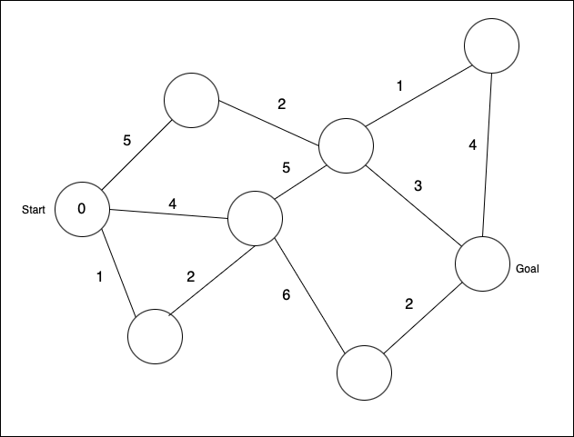

2.未確定ノードの中で最小コストのノードは開始ノードである。  
開始ノードを確定ノードにする。  
(確定ノードはグレーにすることにする)

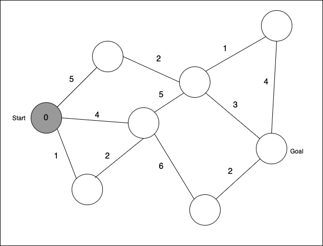

3.確定ノードの隣接ノードの最小コストを更新する

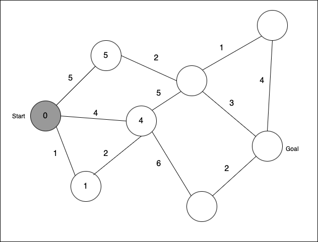

4.全ノードが確定ノードになっていないので、手順2に戻る

5.未確定ノードの中で最小コストのノードを確定ノードにする  
*開始ノードから今回確定ノードにするノードへの最小コストが決まる


6.上記手順で確定した隣接ノードの最小コストを更新する  
*上記手順で確定した隣接ノードの最小コストが4から3に更新できるので、今回は更新する
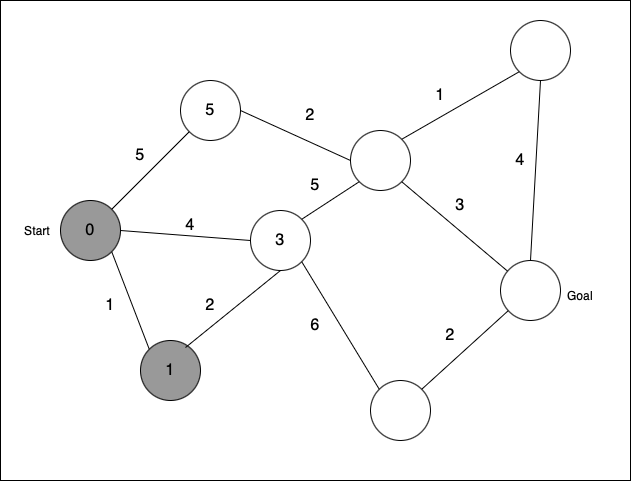

7.全ノードが確定ノードになっていないので、手順2に戻る

8.未確定ノードの中で最小コストのノードを確定ノードにする 
*開始ノードから今回確定ノードにするノードへの最小コストが決まる
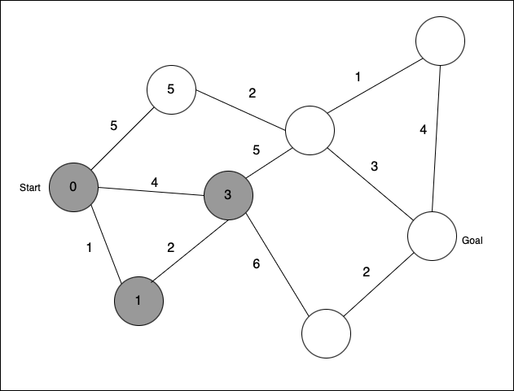

9.上記手順で確定したノードの隣接ノードの最小コストを更新する


9.全ノードが確定ノードになっていないので、手順2に戻る

10.未確定ノードの中で最小コストのノードを確定ノードにする 
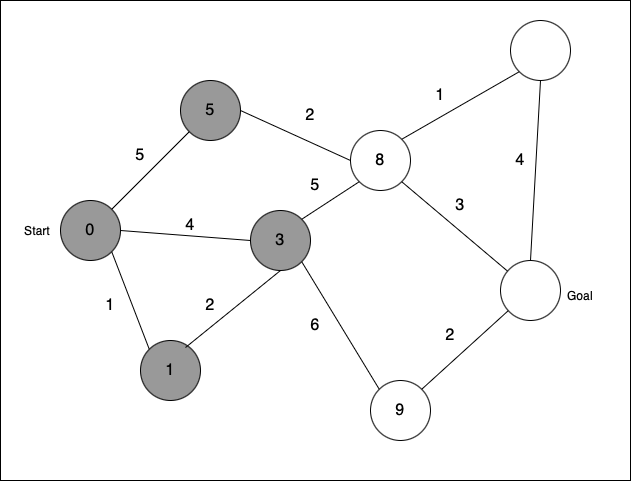

11.上記手順で確定したノードの隣接ノードの最小コストを更新する


12.全ノードが確定ノードになっていないので、手順2に戻る

13.未確定ノードの中で最小コストのノードを確定ノードにする 
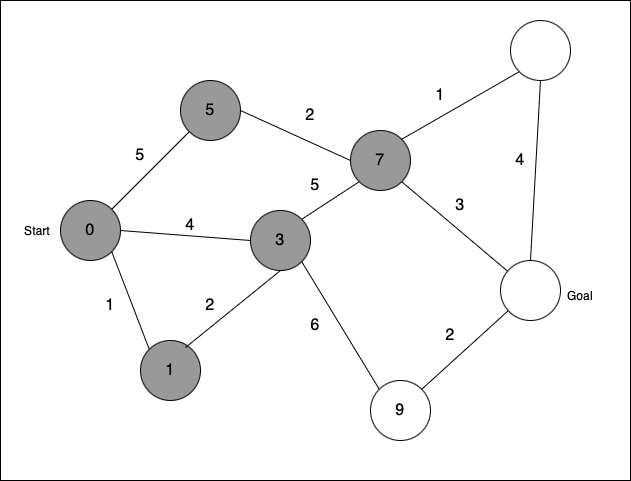

14.上記手順で確定したノードの隣接ノードの最小コストを更新する
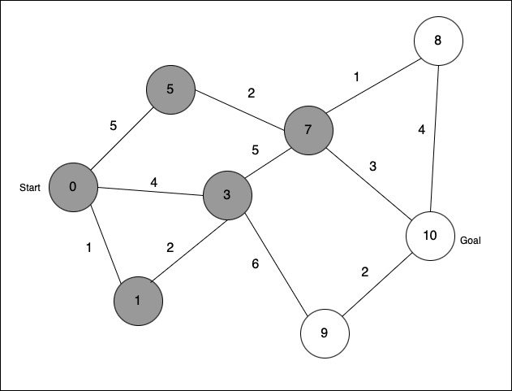

15.全ノードが確定ノードになっていないので、手順2に戻る

16.未確定ノードの中で最小コストのノードを確定ノードにする 
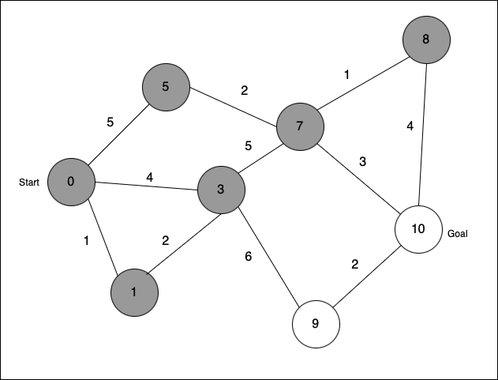

17.上記手順で確定したノードの隣接ノードの最小コストを更新する
*今回は8+4=12で最小コストにはなり得ないので、更新できない


18.全ノードが確定ノードになっていないので、手順2に戻る

19.未確定ノードの中で最小コストのノードを確定ノードにする 
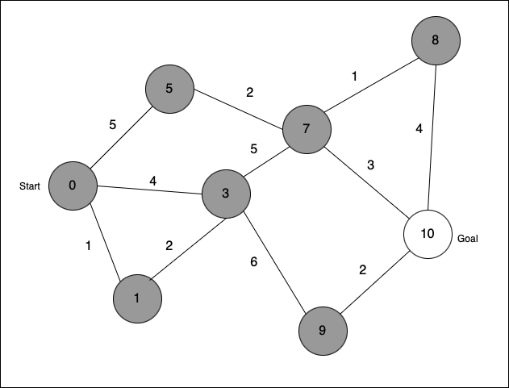

20.上記手順で確定したノードの隣接ノードの最小コストを更新する


21.全ノードが確定ノードになっていないので、手順2に戻る

22.未確定ノードの中で最小コストのノードを確定ノードにする 
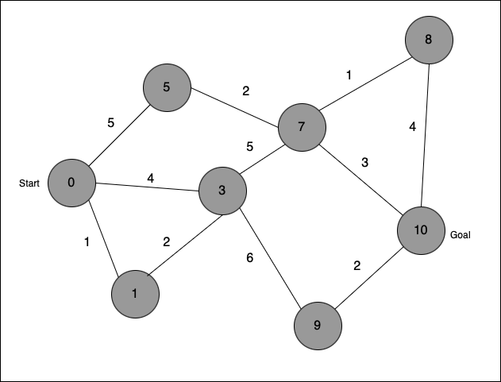

23.上記手順で確定したノードの隣接ノードの最小コストを更新する


24.全ノードが確定ノードになっていなったので終了

TODO: 開始ノードから終了ノードまでの経路の求め方を書く

---

### 計算量

幅優先なのでキューを使う

n: ノードの数とおく  
e: エッジの数とおく  

- 普通のキューを使った場合  
    -> O(n^2)

- 優先度付きキュー(priority queue)を使った場合  
    ->O(elogV)

<br>

考え方
TODO: 考え方を書く