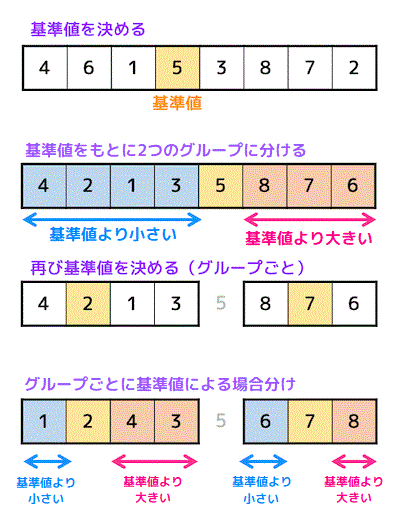
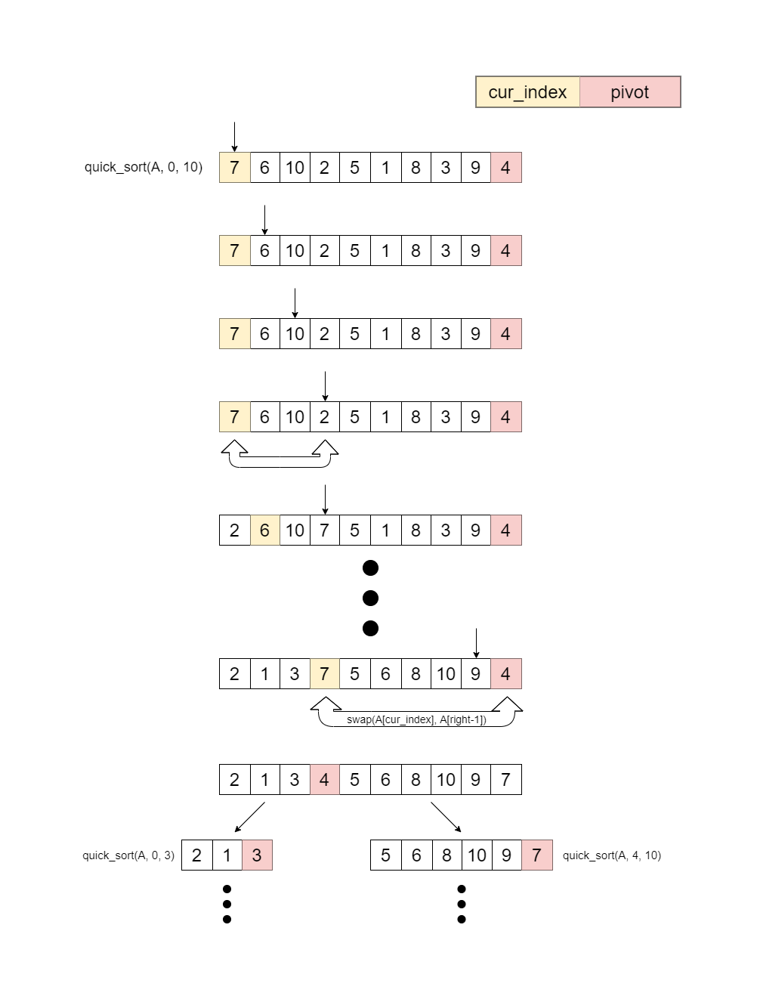

### Quick Sort
- 概要
    - 基準値(ピボット)を決め、それより小さい要素のグループ,大きい要素グループに分ける(パーテショニング)操作を繰り返す

    - 再帰関数を利用してじっそうすることが一般的

 

- 両端から走査していく方法　
</img>
[引用元:工業大学生ももやまのうさぎ塾](https://www.momoyama-usagi.com/entry/info-algo-sort-advance#i)

 

- 片方の端から走査していく方法  
    1. ピボット未満のデータをデータ列の先頭に集める
    2. ピボット未満のデータを挿入する位置を保持する変数(cur_index)を用意  
    *cur_indexはピボット未満のデータがswapされるごとにインクリメントされる

</img>  
[引用元:piza クイックソート (paizaランク B 相当)](https://paiza.jp/works/mondai/sort_efficient/sort_efficient__quick?language_uid=r#:~:text=クイックソートは、%20ピボットと,的に行うアルゴリズムです%E3%80%82)  

---

- ピボットの選び方

クイックソートのパフォーマンスはピボットの選び方に大きく影響される

---

- 計算時間  
    平均計算時間: O(n log n)  
    最悪計算時間: O(n^2)

---

- クイックソートとマージソート

クイックソーとの平均計算時間は O(n log n)で最悪計算時間は O(n^2)  

マージソートの計算時間は O(n log)  (最悪計算時間も O(n log n))

しかし、なぜマージソートよりクイックソートの方が多くの場合において早いアルゴリズムと言われているのか?  

-> ビッグオー記法では定数は無視されるが、実際は O(c * n log n)  
 *cは定数  

 -> クイックソートの定数の方がマージソートの定数よりも小さいため、上記のようなことが言われる。
