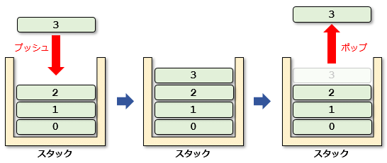

### スタック

- LIFOのデータ構造  
    覚えかた:後に入ったものを先に出す

---

### 実装

- リストで実装する
- 配列で実装する

---

### スタックの各操作の実行時間
    - リストでの実装
        - push: O(1)
        - pop: O(1)

    - 配列での実装
        - push: O(1)
        - pop: O(1)