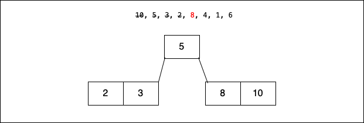

### B木とは

- ルートから各リーフノードへの高さが同じの木構造

- 各ノードが持つ値は1つではなく、複数　=> そうすることで、木の高さを抑える

- 親ノードは子ノードを2つ以上持てる

- DBのインデックスなんかに使われたりする

---

### 具体的なデータ構造の説明

- オーダーとは: ここでは時間計算量ではなく、ノードが最大で持つエッジの数

- 各ノードが持つことのできる値の数は(オーダー - 1)個である

例: Order=3のB-Tree

詳しい説明: もし各ノードが最大で2つの値XとY(X < Yとする)を持つと決めた場合(Oder=3)、その子ノードは

1. Xより小さい値を持つノード
2. Xより大きく かつ Yより小さい値を持つノード
3. Yより大きい値を持つノード

の3つのノードになる

---

### B-Treeのアルゴリズム

- ボトムアップな木構造  
    -> ノードがいっぱいになったら、そこから親ノードを作る  
*しかし、要素を検索/挿入する時はルートノードから辿っていく

 

- 操作
    - Step1: 挿入する要素が登録済みかどうか検索する。登録済みだったらその要素を置き換える

    - Setp2: ルートノードから辿って対象の要素を昇順/降順に挿入する

    - Setp3: ノードが満杯になったら、中央値の要素を親ノードにし、その他要素を子ノードに格納し直す

    - Step4: 全ての要素を挿入し終えたら終了。そうれでなければ、Setp1に戻る

 

- 前提
    - 前提として、ここでは Order=3 の B-Treeを扱うことにする。

    - 値を10, 5, 3, 2, 8, 4, 1, 6 の順番に入れていく

- 操作イメージ

Setp1. 10を挿入する

Setp2. 5を挿入する

Setp3: 3を挿入する

Step4: ノードが溢れるので、そのノードの中央の要素を親ノードにする。また、そのノードの他の要素を子ノードに格納し直す

Step5: 要素2をルートノードから辿って挿入する。(挿入位置はルートノードから辿っていく。2は5より小さいく左の子ノードはまだいっぱいになっていないので、ルートノードの左の子ノードに格納される)

Step6: 要素8をルートノードから辿って挿入する
　

Step7: 要素4をルートノードから辿って挿入する

Step8: ノードが溢れるので、そのノードの中央の要素を親ノードに移す。また、そのノードの他の要素を子ノードに格納し直す

Step9: 要素1をルートノードから辿って挿入する

Step10: 要素6をルートノードから辿って挿入する

Step11: ノードが溢れるので、そのノードの中央の要素を親ノードに移す。また、そのノードの他の要素を子ノードに格納し直す

Step12: 今度は親ノードが溢れるので、そのノードの中央の要素を親ノードに移す。また、そのノードの他の要素を子ノードに格納し直す。

